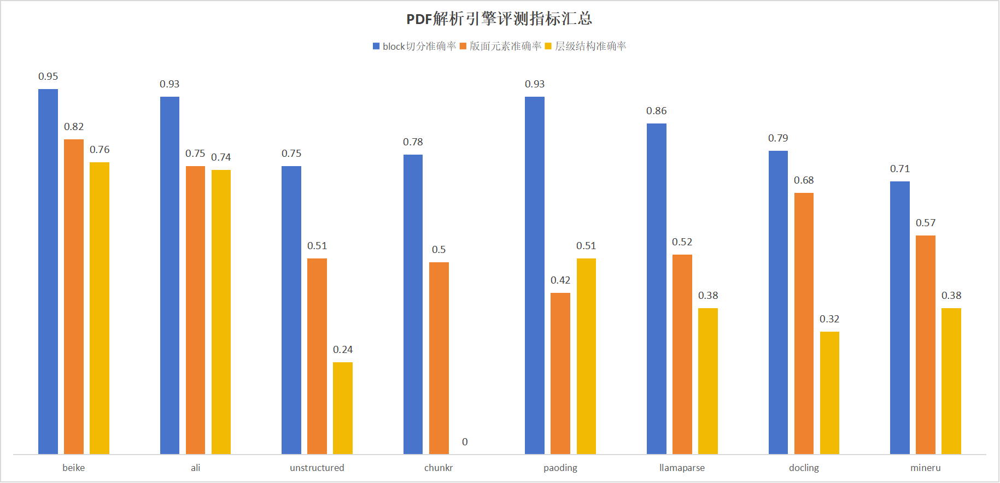

# document_parser


[中文](README.md) | [English Version](README_EN.md)

一个贝壳开源的文档解析Python库。使用Python lib包形式引入，也可以服务化方式运行，支持多种文档格式的解析和转换。

## 功能特点

### 支持多种文件格式
- PDF
- Word文档 (DOCX/DOC)
- Excel表格 (XLSX/XLS)
- CSV文件
- PowerPoint演示文稿 (PPTX)
- 文本文件
- 图片文件 

### 解析功能
- **版面解析 (Layout Parse)**：提取文档的基本布局结构，包括文本块和图片块
- **DOM树解析 (DomTree Parse)**：构建详细的文档对象模型，便于进一步处理和分析
- **Markdown转换**：将解析结果转换为Markdown格式

### 高级功能
- **图像处理**：内置使用大模型ORC能力提取图像信息功能
- **表格处理**：解析表格结构和内容
- **页眉页脚识别**：自动识别和过滤页眉页脚
- **多进程解析**：使用多进程并行处理提高解析效率
- **评测标注功能**：内含评测模块，可标注PDF解析详情


## 系统要求
- Python >= 3.9
- 其他依赖项（详见requirements.txt）

以服务形式启动不依赖贝壳OpenAI开源体系，但文档解析流程依赖贝壳开源的File-API（File-API上传的文件是document-parser的数据来源）

## 环境配置

需要设置以下环境变量：
- OPENAI_API_KEY：用于调用OpenAI API的密钥
- OPENAI_BASE_URL：OpenAI API的基础URL
- OPENAPI_CONSOLE_KEY：需要调用OpenAI console类接口获得元信息时候默认的全局key，目前主要用来获取视觉模型列表，用户可自行实现`VisionModelProvider`返回支持视觉的模型列表

## 快速开始

### library库形式使用

1. 安装依赖

   ```shell
   pip install document_parser
   ```

2. 配置

   ```python
   parser_config = ParserConfig(image_provider=ImageStorageProvider(),
                                ocr_model_name="gtp-4o",
                                # 是否开启OCR能力
                                # 如不开启则vision_model_provider或vision_model_list不需要实现或配置
                                ocr_enable=True, 
                                vision_model_provider=OpenAIVisionModelProvider())
   parser_context.register_all_config(parser_config)
   parser_context.register_user("userId") # 请求模型时的用户ID,如果不设置会影响OCR使用
   ```

3. 执行解析
   ```python
   converter = Converter(stream=stream) # 以文件流的形式传入
   dom_tree = converter.dom_tree_parse( 
       remove_watermark=True,   # 是否开启去水印
       parse_stream_table=False # 是否解析流式表格
   )
   ```

### 服务化运行

1. 从Git下载代码

2. 启动命令

   ```bash
   uvicorn server.app:app --port 8080 --host 0.0.0.0
   ```

*也可以根据自身需要打包成docker镜像

## 优势
从下图效果测评数据可以看出贝壳自研的解析能力很强，正确率更高（基于贝壳有限测评集）




## 致谢

本项目基于 [pdf2docx](https://github.com/dothinking/pdf2docx) 进行二次开发，感谢原作者及其团队的杰出贡献。pdf2docx 是基于 PyMuPDF 提取文本、图片、矢量等原始数据。并基于规则解析章节、段落、表格、图片、文本等布局及样式等，具体功能可访问其GitHub地址。为我们的文档解析功能提供了重要的技术基础。

## 更多文章

[PDF解析： 视觉到结构的重建之旅](./assets/share.pdf)
